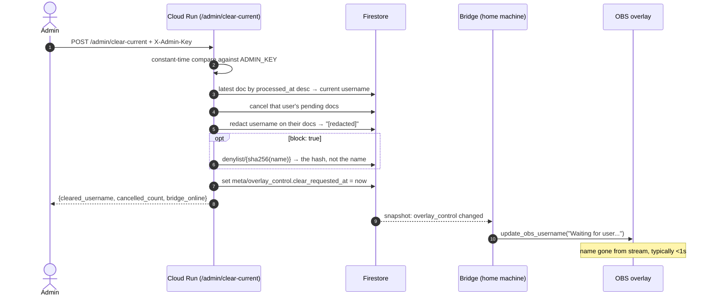

# Admin: clear the current user

> Authentication note: admin actions are reached through the
> Cloudflare Access-protected Worker path `/admin-api/*`. The Worker keeps
> the API key out of the browser and forwards it to the Cloud API.

## Why

`better_profanity` catches the obvious stuff, but creative spelling, leetspeak,
and offensive phrases that aren't single dictionary words get through. When that
happens the name is **on the stream**, and it stays there: the overlay's
username is a module global (`middleware/obs.py: current_obs_username`) that
only changes when the next request is dispatched. Refreshing the OBS browser
source does not clear it — on reconnect the overlay asks for
`current_username` and gets the same global back.

The blunt lever is `POST /admin/queue/clear`, which nukes *everyone's*
pending requests. That's the wrong tool: it punishes the whole audience for one
bad name, and it doesn't even fix the visible problem, since clearing the queue
doesn't touch what's currently displayed.

This design adds a narrow admin action: clear the **currently displayed** user,
leave everyone else's queue intact.

## What it does

One call does four things:

1. **Blanks the overlay** — resets the displayed name to the default
   (`"Waiting for user..."`), which is what `obs.py` already shows before the
   first request.
2. **Cancels that user's pending requests** — otherwise their next queued entry
   puts the same name back on screen within 20 seconds.
3. **Redacts the name in Firestore** — overwrites `username` with `[redacted]`
   on that user's request docs so the stored log doesn't retain the string.
4. **Optionally blocks the name** (`"block": true`) so resubmitting it is
   rejected at `POST /api/color`.

The LED color is left alone — the color isn't the problem, and blanking it
would be a visible glitch for viewers.

## Endpoint

```
POST /admin/clear-current
X-Admin-Key: <ADMIN_KEY>
Content-Type: application/json

{}                                  # clear whoever is on screen now
{"username": "SomeName"}            # or clear a specific name (already scrolled past)
{"block": true}                     # also add to the denylist
```

Response:

```json
{
  "status": "success",
  "cleared_username": "SomeName",
  "cancelled_count": 2,
  "redacted_count": 3,
  "blocked": false,
  "bridge_online": true,
  "message": "Cleared SomeName from the overlay, cancelled 2 pending requests"
}
```

`cleared_username` is `null` and the counts are `0` when nothing is currently
displayed. The call is idempotent — pressing it twice is harmless. A second
press skips docs already showing `[redacted]` rather than "clearing" the
redaction marker, so it returns `cleared_username: null` instead of
`"[redacted]"`.

## Auth

### Why this is *not* behind the Worker's API key

The Cloudflare Worker injects `X-Api-Key` into everything it proxies, so that
key is effectively "anyone who can reach rgboo.com" — it authenticates the
Worker, not a person. An admin action must not sit behind it.

Three-way split in `cloud_api/app.py`'s `before_request`:

| Path | Requires |
|---|---|
| `/` | nothing (health check, so uptime probes work) |
| `/admin/*` | `X-Admin-Key` matching `ADMIN_KEY` (constant-time compare) |
| everything else | `X-Api-Key` matching `API_KEY`, as today |

**Fail closed.** If `ADMIN_KEY` is unset, `/admin/*` returns 500 and rejects —
never falls through to open, and never falls back to `API_KEY`. This mirrors the
existing guard for `API_KEY`; an admin path that quietly opens because an
environment variable didn't get set is the worst failure mode here.

### The key must live in Secret Manager, not an env var

`API_KEY` is a plain env var on the Cloud Run service today. `ADMIN_KEY` cannot
be, because the whole argument for a second key is that this action is more
privileged — and the team group (`rgboo@googlegroups.com`) holds
`roles/editor`, so any member can read the service config. A plain env var would
make the admin key exactly as privileged as the one it's meant to outrank.

```bash
printf "%s" "$(openssl rand -hex 32)" | \
  gcloud secrets create rgboo-admin-key --project=rgboo-leds --data-file=-

gcloud secrets add-iam-policy-binding rgboo-admin-key --project=rgboo-leds \
  --member="serviceAccount:186324327580-compute@developer.gserviceaccount.com" \
  --role="roles/secretmanager.secretAccessor"

gcloud run services update rgboo-api --project=rgboo-leds --region=us-east1 \
  --update-secrets="ADMIN_KEY=rgboo-admin-key:latest"
```

> **Never use `--set-env-vars` or `--set-secrets` here.** Both *replace the
> entire set* rather than adding one. `API_KEY` exists nowhere except the Cloud
> Run config, so `--set-env-vars ADMIN_KEY=…` would destroy it and take the site
> down with no copy to restore from. `--update-env-vars` / `--update-secrets`
> are the additive forms.

Generate the key with `openssl rand -hex 32`. It is a panic button that may end
up in a phone shortcut, but that is a reason for a strong random value, not a
memorable one.

### Reachability

The path is `/admin/...`, **not** `/api/admin/...`. The Worker only proxies
paths starting with `/api/` and 404s everything else
(`web/worker/index.js:53` and `:90`), so `/admin/*` is already unreachable
through rgboo.com without any Worker change. An explicit `/admin` guard in the
Worker is still worth adding as a second layer, but the path choice alone means
a Worker misconfiguration can't expose it.

The admin calls the Cloud Run URL directly:

```
curl -X POST https://rgboo-api-186324327580.us-east1.run.app/admin/clear-current \
  -H "X-Admin-Key: $ADMIN_KEY" -H "Content-Type: application/json" -d '{}'
```

Note that this URL is public and the service is deployed
`--allow-unauthenticated` — `ADMIN_KEY` is the only thing in front of this
endpoint. That is the same trust model as `API_KEY` and is acceptable, but it is
why the key must be strong and secret-managed.

Practically: save that curl as a phone shortcut or a shell alias — it's a panic
button, it needs to be one tap while you're on camera.

## How the overlay actually gets cleared

The cloud can't reach the bridge (home machine, outbound connections only), so
the clear travels the same way everything else does — through Firestore:

- **`meta/overlay_control`** — written *only* by the cloud API:
  `{clear_requested_at: <timestamp>}`.
- The **bridge** holds an `on_snapshot` listener on that doc. When
  `clear_requested_at` is newer than the last value it handled, it calls the
  existing `update_obs_username("Waiting for user...", socketio)` — the same
  function the dispatch loop already uses. No new overlay code, no template
  change.
- **The 300s resync poll also re-reads this doc.** The bridge already runs that
  poll (`bridge/listener.py: PendingPoller`) precisely because a snapshot stream
  can die quietly behind NAT. A panic button that silently stops working is
  worse than not having one, so the control doc gets the same safety net the
  queue has.

Keeping the command doc cloud-owned and separate from any bridge-written state
means the two sides never write the same fields. Delivery is typically well
under a second, which is fine for a panic button.

On startup the bridge reads the doc once and treats the current value as
already handled — the overlay is blank at boot anyway.

## Determining "the current user" — no new state needed

The cloud doesn't track who's on screen, and it doesn't need to. The bridge
already stamps `processed_at` when it dispatches a request, so:

```
requests.order_by('processed_at', DESCENDING).limit(1)
```

is the currently displayed user. Pending docs have `processed_at = null`, and
Firestore sorts nulls lowest, so a descending sort returns the most recently
dispatched doc. A single-field index covers this automatically — no composite
index to configure, no extra writes per dispatch, no new fields.

**Verified against the live database** with a mix of dispatched, pending and
cancelled docs: the query returned exactly the most recently dispatched one,
and the pending/cancelled nulls sorted to the bottom.

> **Load-bearing detail:** this works because `cloud_api/store.py` writes an
> explicit `'processed_at': None` on creation. Firestore's `order_by` *excludes*
> documents missing the field entirely — so if anyone ever "tidies up" that null,
> pending docs would silently drop out of this query. Worth a comment at both the
> write site and the query.

This deliberately matches the existing behavior that the overlay updates even
when the serial write fails (`color_queue.py:119-130` calls the OBS callback
regardless), because such a doc still has `processed_at` set.

## Sequence



## Optional: blocking the name from coming back

With `"block": true`, the name is added to a denylist and `POST /api/color`
checks it alongside the profanity filter — one extra Firestore read per
submission, negligible against the 50k/day free tier.

**Store the hash, not the name.** The document ID is
`sha256(username.strip().lower())`:

```python
doc_id = hashlib.sha256(username.strip().lower().encode()).hexdigest()
```

Writing the raw string as a document ID would undo step 3 of this very design:
we overwrite `username` with `[redacted]` so the offensive string isn't retained,
then storing it as a doc ID puts it right back — plainly visible in the Firestore
console. Exact-match blocking works identically on a hash, and the string never
lands anywhere durable. The doc body holds only `{blocked_at: <timestamp>}`.

Be honest about what this buys: exact-string matching is weak, and anyone
determined just appends a digit. It's a speed bump for the lazy repeat
offender, not a real defense. Worth having because it's ~10 lines; not worth
building anything more elaborate for a fun project.

Also note this is a pre-existing gap, not one this design introduces:
`POST /api/color` has no server-side rate limit (the client's 30s cooldown is
`localStorage`-only and advisory), so a determined spammer can already push
Firestore usage. If that ever becomes real, the fix belongs at the Cloudflare
edge — a rate-limit rule or Turnstile on the Worker — not in the API.

## Where the code lands

| Piece | File |
|---|---|
| `ADMIN_KEY` read from env (populated by Secret Manager) | `cloud_api/config.py` |
| Three-way auth split, failing closed | `cloud_api/app.py` |
| `POST /admin/clear-current` | `cloud_api/routes.py` |
| `get_current_username`, `cancel_pending_for_user`, `redact_username`, `request_overlay_clear`, denylist helpers | `cloud_api/store.py` |
| Denylist check in `POST /api/color` | `cloud_api/routes.py` |
| `meta/overlay_control` listener + resync poll coverage | `bridge/listener.py`, `bridge/main.py` |
| Explicit `/admin` guard (defense in depth) | `web/worker/index.js` |
| Admin requests + auth cases | `postman/rgboo-api.postman_collection.json` |
| Secret Manager wiring | `docs/gcp-setup.md`, deploy step |

Tests follow the existing pattern (`cloud_api/tests/`): mock store for the route,
plus auth cases in `test_auth.py` — admin path rejects the regular `X-Api-Key`,
accepts `X-Admin-Key`, `/api/*` is unaffected by the admin key, and `/admin/*`
rejects when `ADMIN_KEY` is unset.

Add the endpoint to the Postman collection in the same change. A panic button
you have never pressed is one you won't trust at the moment you need it.

## Index requirements

None. Two checks against the live database:

- `order_by('processed_at', DESC).limit(1)` — served by the automatic
  single-field index.
- `where('username','==',X).where('status','==','pending')` — two equality
  filters, which Firestore serves by merging single-field indexes. **No
  composite index needed.**

Worth stating explicitly because `GET /api/queue` *does* need a composite index
(`status` + `scheduled_time`), and that requirement only surfaced at deploy time
as a 500.

## Edge cases

- **Bridge offline** — the control doc is still written and the response says
  `bridge_online: false`, so the admin knows the overlay hasn't visibly changed
  yet. It blanks when the bridge reconnects.
- **Nothing displayed yet** — `cleared_username: null`, counts `0`, still
  succeeds.
- **Pressed twice** — the second call finds the top doc already redacted, skips
  it, and returns `cleared_username: null` with zero counts.
- **Race with a new dispatch** — if a legitimate request lands in the ~1s
  between the button press and the bridge handling it, that user's name gets
  blanked too. Self-healing: the next dispatch repopulates within 20s. Not
  worth guarding against.
- **Request already in flight** — if the bridge has passed its re-read and is
  mid-serial-write, that name still reaches the overlay. The clear then blanks
  it a moment later. Acceptable for a ~1s window.
- **Name already scrolled past** — use `{"username": "..."}` to target it
  directly.

## Verification

1. Submit a request with a benign name, let it dispatch, confirm it's on the
   overlay.
2. `curl` the admin endpoint with no key → 401; with the *Worker's* `API_KEY`
   → 401; with `ADMIN_KEY` → 200.
3. Unset `ADMIN_KEY` on a local run → `/admin/clear-current` returns 500, and
   `/api/color` still works.
4. Confirm the overlay resets to "Waiting for user..." within a second or two.
5. Queue two requests from that name plus one from another name; clear; confirm
   only the offender's are cancelled and the other still dispatches on schedule.
6. Check Firestore: the offender's docs show `username: "[redacted]"`, and the
   denylist doc ID is a hex hash with no readable name anywhere.
7. With `{"block": true}`, resubmit the same name → 400.
8. Confirm `https://rgboo.com/admin/clear-current` returns 404 (never proxied).
9. Kill the bridge's snapshot stream, press the button, confirm the overlay
   still clears on the next resync poll.
10. Run the Postman collection — existing requests unaffected by the new auth
    branch.
