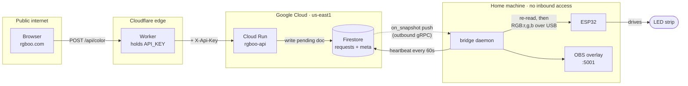
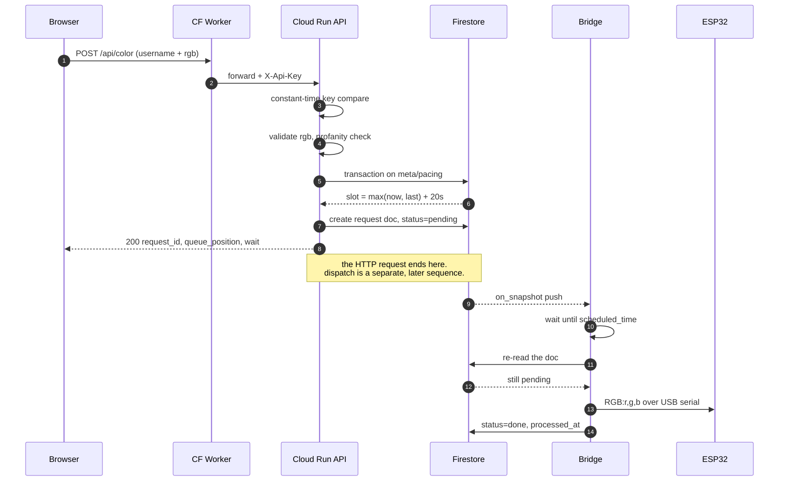
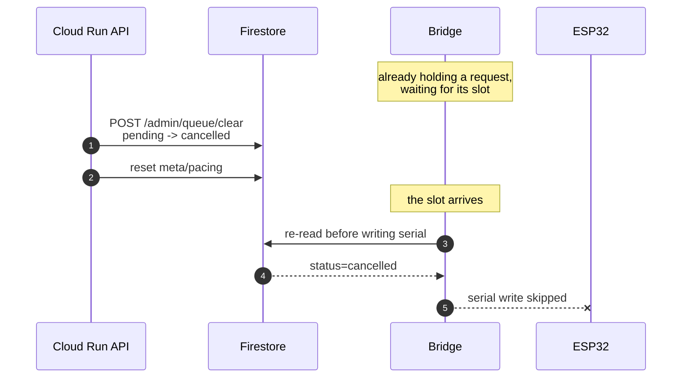

# Architecture

RGBoo lets anyone on the internet set the colour of a physical LED strip, one
person at a time. This describes the GCP-based system: what runs where, how a
request becomes light, and why the pieces are split the way they are.

Related: [local-setup.md](local-setup.md) (running it yourself),
[gcp-migration-plan.md](gcp-migration-plan.md) (how we got here),
[gcp-setup.md](gcp-setup.md) (provisioning), [deploying.md](deploying.md) (shipping changes).

## The constraint that shapes everything

The LED strip is on a USB cable plugged into a machine at home. No cloud
server can reach a USB port, and that machine has no inbound access. So the
system splits in two, and the split is at the queue:

- **Cloud** accepts requests, validates them, and decides *when* each one runs.
- **Home** reads that decision and does the physical write.

Neither half calls the other. They meet at a Firestore document.

## Components

| Component | Runs on | Owns |
|---|---|---|
| `web/src/` | Browser | Colour picker UI |
| `web/worker/` | Cloudflare edge | Serves the app; proxies `/api/*` and adds the API key |
| `cloud_api/` | Cloud Run (`us-east1`, scale-to-zero) | Validation, pacing, the queue and its log |
| Firestore | GCP (`us-east1`, Native mode) | The queue, the pacing clock, bridge liveness |
| `bridge/` | Home machine (systemd) | Waiting for each slot, USB serial write, OBS overlay |
| `firmware/` | ESP32 | Reads `RGB:r,g,b` from serial, drives the LEDs |

`shared/` holds the constants both halves must agree on: collection names,
status values, and `SLOT_SECONDS = 20`.

## System view

The dotted line is the only thing crossing into the home network, and it is
opened *from* the inside. There is no port forwarding and no tunnel.

## Setting a colour

The pacing transaction (5–6) is what guarantees one colour every 20 seconds
even with concurrent requests and multiple API instances — it is the
distributed replacement for a mutex.

## Cancelling

Worth its own diagram, because it is the one place the design is non-obvious.

Without that re-read, clearing the queue would empty the list while the LEDs
still changed — the bridge would already be holding the request.

## Data model

Three collections plus two control documents. No schema migrations, no joins.

**`requests/{auto-id}`** — one document per colour request, and the request log:

| Field | Written by | Notes |
|---|---|---|
| `username`, `r`, `g`, `b` | API | Validated before write |
| `status` | API, then bridge | `pending` → `done` \| `failed` \| `cancelled` |
| `scheduled_time` | API | The slot; the bridge sleeps until this |
| `created_at`, `processed_at` | API, bridge | `processed_at` is a server timestamp |

**`meta/pacing`** — `last_scheduled_time`, the clock the slot transaction reads
and advances.

**`meta/bridge`** — `last_seen`, `serial_connected`, `serial_port`. Written
every 60s; a heartbeat older than 120s means offline, which is how the cloud
answers "is the hardware alive?" without being able to reach it.

**`meta/overlay_control`** — `clear_requested_at`. Written only by the API,
watched only by the bridge: the channel an admin clear travels down, since the
cloud cannot call the home machine. See
[admin-clear-current.md](admin-clear-current.md).

**`denylist/{sha256(name)}`** — blocked usernames, keyed by hash so a redacted
name is never stored in readable form.

## API

`GET /` is open. `/api/*` and `/admin/*` require `X-Api-Key`. The Worker
exposes admin routes to the Cloudflare Access-protected admin page as
same-origin `/admin-api/*` paths and forwards its existing API credential.

| Route | Does |
|---|---|
| `GET /` | Health, plus `bridge_online` and `serial_connected` from the heartbeat |
| `POST /api/color` | Validate → assign slot → create pending doc |
| `GET /api/status` | Queue size, next free slot, hardware state |
| `GET /api/queue` | Pending requests in slot order |
| `POST /admin/queue/clear` | Cancel **all** pending. **Cloudflare Access JWT** |
| `POST /admin/queue/remove` | Cancel one request by ID. **Cloudflare Access JWT** |
| `POST /admin/clear-current` | Pull one user off the overlay. **Cloudflare Access JWT** |

## Design decisions

| Decision | Why |
|---|---|
| Firestore, not Pub/Sub | Pending work must be *listable* and *cancellable*. Queue messages are neither. |
| Cloudflare Access plus Worker credential | Human admins authenticate through the existing email allowlist; the browser never receives the Worker-to-API key. |
| Slot assigned by the API, not the bridge | Pacing survives a bridge restart, and callers learn their wait immediately. |
| Bridge re-reads before the serial write | The only way a cancellation can beat a request the bridge already holds. |
| Bridge sorts pending locally | Keeps its listener a single-field query, so it needs no composite index. The API sorts server-side and does need one. |
| `on_snapshot` + slow poll | The push stream is outbound so it needs no open port; a 300s poll covers a stream that dies quietly. |
| Scale-to-zero, `min-instances=0` | ~4.3k requests/day maximum. A cold start of 1–2s is invisible against a 20s queue. |

## Failure modes

| If this happens | Then |
|---|---|
| Bridge crashes or reboots | Pending docs stay in Firestore; systemd restarts it and overdue slots dispatch immediately. Nothing is lost. |
| Bridge stays down | API keeps accepting requests; `bridge_online` goes false after 2 min. Work queues rather than fails. |
| API deploy mid-queue | Invisible. The queue is in Firestore, not in the API process. |
| ESP32 unplugged | Request marked `failed` with the error; the queue keeps moving. |
| Serial write fails after re-read | Doc left `pending`; the next resync retries rather than dropping it. |
| Firestore unreachable from home | Bridge logs and retries; heartbeat goes stale, so the cloud reports it offline. |

## Security

- **Secret:** `API_KEY` (Worker → API) and the bridge's service-account key. The admin page is protected by Cloudflare Access, while the Worker keeps the API key out of the browser.
- **Not secret:** `ALLOWED_ORIGINS` and the upstream URL. CORS is announced in every response — it constrains what *other websites* can do in a browser, and stops nothing else.
- **Deliberately open:** anyone can `POST /api/color` through rgboo.com; it is a public community project. Abuse is limited by the 20s pacing and the profanity filter, not by auth.
- **Deploy identity:** GitHub Actions authenticates by Workload Identity Federation, pinned to this repository. No key is stored in GitHub, and the identity can only push images and deploy Cloud Run.

## Current state

The cloud half is live; the cutover has not happened.

| Piece | State |
|---|---|
| `cloud_api/` on Cloud Run | Live and verified |
| Firestore + composite index | Live |
| `bridge/` | Code complete, tested, verified in `--dry-run`. Not yet installed under systemd. |
| `web/worker/` | Parameterised for cutover, still pointing at the old upstream |
| `middleware/` | **Still serving all real traffic** via Cloudflare Tunnel |

Until Phase 5 flips `API_UPSTREAM`, every real colour still travels the old
path: Worker → Cloudflare Tunnel → Flask middleware → USB.

## Cost

Everything sits inside the always-free tiers — Cloud Run scales to zero, and
one request per 20 seconds caps Firestore at roughly 4.3k writes/day. A $1
budget alert on the billing account is the tripwire.
